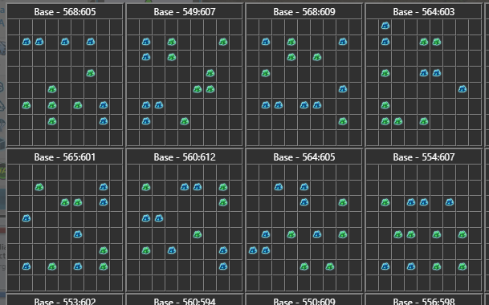
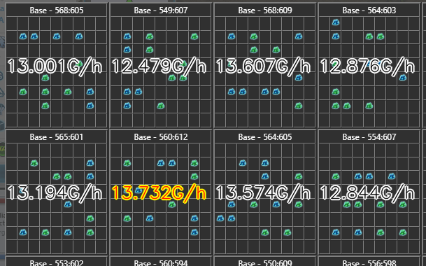

# TAOptimizer - Tiberium Alliances (Power) Optimizer

## Purpose
This is a small project to optimize configurations within the multi player online strategy game Tiberium Alliances.
Currently it only allows searching for the optimal base layout in terms of power production rate. But the code could easily be extended to optimize for other parameters.

## How to run
If you're using Conda, you can create the proper environment running:

`conda env create -f environment.yml`

Then essentially run main.py, changing the parameters depending on what you want.
Two types searches are supported:

1) Optimize a single layout given by a [CncTaOpt](https://www.cnctaopt.com/)-link
2) Optimize all layouts given by a screenshot from the TA-BaseScanner script. Here is an example of the input/output:


->


## Open Points
At the moment the search is a simple brute force depth-first search. This is too slow to find the guaranteed optimal solution in reasonable time. It seems that by setting the top_n parameter to 2, optimal solutions are returned (I have not found a counter example). However, even this is slow and there could be a case where it doesn't return the optimal solution. Using an A* search might be faster, but finding a good (and admissible) heuristic for this problem is not trivial.

Further improvement of the existing code can be done by focusing on the key functions. 
Profiling can be generated like this:

````
python -m cProfile -o main.profile main.py
python -m pstats main.profile
sort tottime
stats 15
````